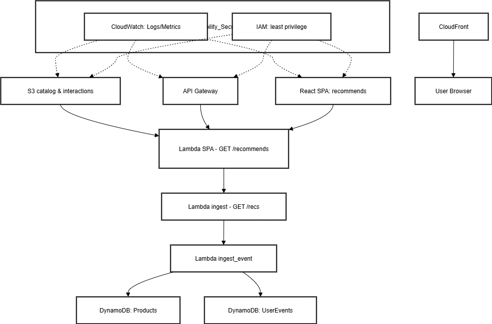

# AI-Powered Product Recommendation Engine (AWS)

  

A serverless recommendation API running on **AWS Lambda + API Gateway (HTTP API)** with a clean, testable **Python 3.11** codebase. Designed to be extended with **Amazon Personalize**, **DynamoDB**, and a lightweight **React** frontend (S3 + CloudFront).

---

## 🚀 Live Demo

**Base URL:** [https://hcqne2tob5.execute-api.us-east-2.amazonaws.com/prod](https://hcqne2tob5.execute-api.us-east-2.amazonaws.com/prod)

**Endpoints**

* `GET /recommendations/personalized?userId=U1&k=3`
* `GET /recommendations/related?itemId=I100&k=3`
* `POST /events` (JSON body)

**Try in your browser**

* Personalized: [https://hcqne2tob5.execute-api.us-east-2.amazonaws.com/prod/recommendations/personalized?userId=U1\&k=3](https://hcqne2tob5.execute-api.us-east-2.amazonaws.com/prod/recommendations/personalized?userId=U1&k=3)
* Related: [https://hcqne2tob5.execute-api.us-east-2.amazonaws.com/prod/recommendations/related?itemId=I100\&k=3](https://hcqne2tob5.execute-api.us-east-2.amazonaws.com/prod/recommendations/related?itemId=I100&k=3)

> Tip: API versioning (`/v1/...`) and a `GET /health` endpoint are recommended below. The live demo currently uses unversioned paths under `/prod`.

---

## ✨ What's Implemented

* **Serverless API:** API Gateway (HTTP API) -> Lambda (Python 3.11)
* **Handlers:** `personalized` (mock top-N for a user), `related` (mock similar items), `events` (ingest JSON events)
* **OpenAPI:** `services/api/openapi.yaml` (excerpt below)
* **Unit tests:** `pytest` (happy paths + basic error cases)
* **Repo layout:** ready for CI/CD, infrastructure, and data utilities

---

## 📦 Project Structure

```
services/
  api/
    lambda_fn/
      app.py
      util.py
    openapi.yaml
    tests/
      test_api.py
data/
  generators/
    generate_synthetic.py
infra/
  terraform/
    main.tf  variables.tf  outputs.tf
.github/
  workflows/
    cicd.yml
README.md
```

---

## 🔌 Endpoint Summary

| Method | Path                          | Query/body                                |
| -----: | ----------------------------- | ----------------------------------------- |
|    GET | /recommendations/personalized | userId (string, req), k (int, 1-100, opt) |
|    GET | /recommendations/related      | itemId (string, req), k (int, 1-100, opt) |
|   POST | /events                       | { userId, itemId, event\_type }           |

**Sample 200 OK**

```json
{ "userId": "U1", "items": [{"id": "I42", "score": 0.91}, {"id": "I7", "score": 0.83}] }
```

**Sample 400 Bad Request**

```json
{ "error": "k must be between 1 and 100" }
```

**Events body example**

```json
{ "userId": "U1", "itemId": "I100", "event_type": "view", "ts": "2025-08-16T18:30:00Z" }
```

---

## 🧪 Quick Start (Local)

**Requirements:** Python 3.11+, pip

```bash
# create & activate venv (Windows Git Bash)
python -m venv .venv
source .venv/Scripts/activate

# install deps & run tests
python -m pip install --upgrade pip
python -m pip install -r services/api/requirements.txt
python -m pytest -q
```

---

## 🧪 cURL Examples

```bash
BASE="https://hcqne2tob5.execute-api.us-east-2.amazonaws.com/prod"

curl "$BASE/recommendations/personalized?userId=U1&k=3"

curl "$BASE/recommendations/related?itemId=I100&k=3"

curl -X POST "$BASE/events" \
  -H "content-type: application/json" \
  -d '{"userId":"U1","itemId":"I100","event_type":"view"}'
```

---

## 🧱 Architecture



---

## 🔌 API Reference (v1 recommended)

### GET /v1/recommendations/personalized

Query params: `userId` (string, required), `k` (int, 1-100, default 5)

**200 OK**

```json
{ "userId": "U1", "items": [{"id": "I42", "score": 0.91}] }
```

**400 Bad Request**

```json
{ "error": "k must be between 1 and 100" }
```

### GET /v1/recommendations/related

Query params: `itemId` (string, required), `k` (int, 1-100, default 5)

**200 OK**

```json
{ "itemId": "I100", "related": [{"id": "I7", "score": 0.67}] }
```

### POST /v1/events

Headers: `Content-Type: application/json`
Optional: `Idempotency-Key` (string) for safe retries

**Body**

```json
{ "userId": "U1", "itemId": "I100", "event_type": "view", "ts": "2025-08-16T18:30:00Z" }
```

`event_type` must be one of `view`, `add_to_cart`, `purchase`.

**202 Accepted**

```json
{ "ok": true }
```

**400 Bad Request**

```json
{ "error": "Missing userId" }
```

### GET /v1/health

**200 OK**

```json
{ "ok": true, "version": "1.0.0" }
```

---

## 🔒 Security & Privacy

* **Auth (demo-friendly):** API keys or Cognito user pool; CORS allow-list for the demo UI
* **Throttling:** API Gateway rate/burst limits
* **Idempotency:** optional `Idempotency-Key` for `POST /events`
* **Data discipline:** `userId`/`itemId` are pseudonymous; avoid PII
* **Encryption:** KMS for S3 and DynamoDB
* **WAF:** attach AWS WAF to API Gateway (optional)

---

## 📈 Observability

* Structured logging/metrics/tracing via **AWS Lambda Powertools** (`Logger`, `Metrics`, `Tracer`)
* **CloudWatch Dashboard:** p50/p95 latency, 4xx/5xx, Lambda errors, invocations
* **Alarms:** error rate and latency -> SNS (email/Slack)

---

## 🗄️ Data & Storage (recommended)

* **DynamoDB**

  * `catalog` (PK: `itemId`)
  * `events` (PK: `userId`, SK: `ts`), TTL for cost control
  * Optional: `related_items` (precomputed store)
* **S3** for batch data lake and Personalize datasets

**Synthetic data:** `data/generators/generate_synthetic.py` can create users/items/events and write JSON to local or S3.

---

## 🤖 Amazon Personalize (optional path)

* Dataset group, schema, dataset, imports from S3
* Solution (User-Personalization), Campaign for realtime
* In `util.py`, if `PERSONALIZE_CAMPAIGN_ARN` is set -> call `GetRecommendations`; otherwise, fallback to mock logic

---

## 🧰 Manual Deploy (quick path)

**Zip Lambda code** (from `services/api/lambda_fn`):

```powershell
# Windows PowerShell
Compress-Archive -Path * -DestinationPath ../lambda.zip -Force
```

Upload to **AWS Lambda** (Console):

* Runtime: **Python 3.11**
* Handler: **app.handler**
* Code: upload `services/api/lambda.zip`

Create an **HTTP API** (API Gateway) and attach the Lambda to routes:

* `GET /recommendations/personalized`
* `GET /recommendations/related`
* `POST /events`

Create stage **prod** with **Auto-deploy ON** and use the stage Invoke URL.

> Perf tips: Use **ARM64**, memory 512–1024MB, and (optionally) **Provisioned Concurrency = 1** for stable demo latency.

---

## 🛠️ CI/CD (suggested)

**.github/workflows/cicd.yml** should:

1. Lint (`ruff`) and type-check (`mypy`)
2. Test (`pytest -q`)
3. Package Lambda (ARM64) and push artifact
4. Plan/apply **Terraform** in `infra/terraform` for API/Lambda/IAM/DynamoDB/S3/CloudWatch

---

## 🔍 OpenAPI (excerpt)

```yaml
openapi: 3.0.3
info: { title: Recs API, version: "1.0.0" }
paths:
  /v1/recommendations/personalized:
    get:
      parameters:
        - name: userId
          in: query
          required: true
          schema: { type: string }
        - name: k
          in: query
          schema: { type: integer, minimum: 1, maximum: 100, default: 5 }
      responses:
        "200": { description: OK }
        "400": { description: Bad Request }
  /v1/events:
    post:
      requestBody:
        required: true
        content:
          application/json:
            schema:
              type: object
              required: [userId, itemId, event_type]
              properties:
                userId: { type: string }
                itemId: { type: string }
                event_type: { type: string, enum: [view, add_to_cart, purchase] }
```

---

## 💵 Cost Profile (demo)

With low demo traffic and short retention windows, typical monthly cost should be **low (single-digit USD)**. Largest drivers: API Gateway requests, Lambda invocations, and any Personalize campaign hours (if enabled).

---

## 🧭 Roadmap

* Amazon Personalize integration (real recommendations)
* Batch & retraining via Step Functions/EventBridge
* DynamoDB (catalog + event storage)
* React frontend on S3 + CloudFront
* Observability (CloudWatch dashboards, alarms)
* IaC expansion (Terraform for API/Lambda/roles)

---

## 📄 License

MIT

